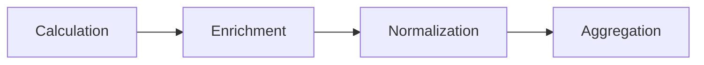

# Computation Pipeline

## Introduction

The execution of a  graph involves 4 phases:



- **Calculation**: Calculating the impacts of every component (leaf) node.
- **Enrichment**: Enriching the impacts, for example, calculating the carbon from energy using grid emissions data.
- **Normalization**: Bucketing the impacts into an output time series based on a configured *globally defined* impact duration.
- **Aggregation**: Aggregating the inputs by each time bucket, up the impact graph, to the parent nodes, and finally, the root node 

## Calculation

We loop through the impact graph and component node by component node, pass in the provided observations to the configured model plugins, and capture the outputs as a series of Impact Metrics.

> [!note] 
> 
> If multiple observations have been provided, we provide **multiple** output impact metrics. At this stage 1-1 mapping exists between an Observation and an output Impact Metric.


> [!important] 
> Each input observation is for a time and duration, and each output impact metric is for the same time and duration. We should link an Impact Metric to the exact observation used to generate it.

Represented as [Impl (Impact YAML)](Impl%20(Impact%20YAML).md), the calculation phase would compute every component node in the tree with **observations** like so:

```yaml
component:
  observations: 
      - timestamp: 2023-07-06T00:00
        duration: 15 
        cpu: 33%
      - timestamp: 2023-07-06T00:05
        duration: 5
        cpu: 23%
      - timestamp: 2023-07-06T00:05
        duration: 5
        cpu: 11%
```

To components with **impacts**, like so:

```yaml
component:
  impacts:
      - timestamp: 2023-07-06T00:00
        duration: 15 
        energy: 23 mWh
      - timestamp: 2023-07-06T15:00
        duration: 5
        energy: 20 mWh
      - timestamp: 2023-07-06T20:00
        duration: 5
        energy: 18 mWh  
  observations: 
      - timestamp: 2023-07-06T00:00
        duration: 15 
        cpu: 33%
      - timestamp: 2023-07-06T15:00
        duration: 5
        cpu: 23%
      - timestamp: 2023-07-06T20:00
        duration: 5
        cpu: 11%
```

## Enrichment

This phase involves enriching the calculated impacts with any other data. The primary use case for this phase is to convert any energy values in the impacts to carbon values using grid emissions data.

### Grid Emissions
The enrichment phase enables us to consistently apply the same grid emissions source, granularity, and methodology (average vs. marginal), to all components.

This phase should instantiate a global grid emissions service. The service *could* return simply a global yearly average if grid emissions are not crucial in this graph. The service could be more advanced, using a vendor that produces granular data for grid emissions by time and region. The important thing is that we are using the **same grid emissions service and methodology for all impacts**.

> [!note] 
> For the enrichment with grid emissions to work, each impact metric needs to have 
> - time 
> - duration 
> - location 
> - energy
> 
> If all those parameters exist, then we can source a grid emissions intensity and apply to energy to generate carbon (operational emissions as per the SCI spec)

### Example

Represented as [Impl (Impact YAML)](Impl%20(Impact%20YAML).md), the enrichment phase would compute every component node in the tree with **energy impacts** and **locations** like so:

```yaml
component:
  impacts:
      - timestamp: 2023-07-06T00:00
        duration: 15 
        location: west-us
        energy: 23 mWh
      - timestamp: 2023-07-06T00:05
        duration: 5
        location: west-us
        energy: 20 mWh
      - timestamp: 2023-07-06T00:05
        duration: 5
        location: west-us
        energy: 18 mWh  
```

Into nodes with operational carbon emissions (energy * grid emissions) using the grid emissions intensity at the time and location, like so:

```yaml
component:
  impacts:
      - timestamp: 2023-07-06T00:00
        duration: 15 mins
        location: west-us
        energy: 43 mWh
        grid-intensity: 500 gCO2e / kWh
        operational-emissions: 4.7g gCO2e
      - timestamp: 2023-07-06T15:00
        duration: 5 mins
        location: west-us
        energy: 20 mWh
        grid-intensity: 490 gCO2e / kWh
        operational-emissions: 2.9 gCO2e       
      - timestamp: 2023-07-06T25:00
        duration: 5 mins
        location: west-us
        energy: 18 mWh  
        grid-intensity: 470 gCO2e / kWh
        operational-emissions: 2.8g gCO2e         
```

## Normalization

The next phase is for each leaf node to normalize the output impact metrics to a time series defined by a global *impact duration*.

> [!warning] 
> After normalization, we will lose the 1-1 mapping between input observations and output impact metrics, and the impact metrics will snap to a new time series defined by the impact duration.

>[!note]
> The output impact metric is effectively zero if no impact metric overlaps a given time and duration. It means nothing was running then, so there could not be any emissions from the component.

An impact metric might be of a longer or smaller duration than the new globally defined impact duration or overlaps the new impact duration in some way. There can be many algorithms we can use to bucket/slice up the values, but a good default strategy is to use a weighting of time. 

### Example

Take, for example, the enriched data points from the example above, they each have mixed durations, some are 5, and some are 15mins.

| Timestamp        | Duration | Energy | Location | Grid | Operational |
| ---------------- | -------- | ------ | -------- | ---- | ----------- |
| 2023-07-06T00:00 | 15       | 43     | west-us  | 500  | 4.7         |
| 2023-07-06T05:00 | 5        | 20     | west-us  | 490  | 2.9         |
| 2023-07-06T10:00 | 5        | 18     | west-us  | 470  | 2.8         |

If we had decided to bucket the output impacts in 5 mins increments, we would specify an impact duration of 5 mins. This phase determines how to normalize the buckets to 5 min durations.

This effectively boils down to a choice of what weighting to use. The simplest would be to weight by time. So the first duration is 15 mins long; if we wanted to visualize in 5 min buckets, we would divide the impacts by 3.

> [!important]
> The decision to weight an impact to the new duration or copy it is determined by its unit of measurement. If the unit is a rate like gCO2e/kWh, we will copy it to the new buckets. Only some impacts will be weighted.


| Timestamp        | Duration | Energy | Location | Grid | Operational |
| ---------------- | -------- | ------ | -------- | ---- | ----------- |
| 2023-07-06T00:00 | 5        | 14.3   | west-us  | 500  | 1.57        |
| 2023-07-06T05:00 | 5        | 14.3   | west-us  | 500  | 1.57        |
| 2023-07-06T10:00 | 5        | 14.3   | west-us  | 500  | 1.57        |
| 2023-07-06T15:00 | 5        | 20     | west-us  | 490  | 2.9         |
| 2023-07-06T25:00 | 5        | 18     | west-us  | 470  | 2.8         |

This would translate to YAML like so:

```yaml
component:
  impacts:
      - timestamp: 2023-07-06T00:00
        duration: 5 mins
        location: west-us
        energy: 14.3 mWh
        grid-intensity: 500 gCO2e / kWh
        operational-emissions: 1.57g gCO2e
      - timestamp: 2023-07-06T05:00
        duration: 5 mins
        location: west-us
        energy: 14.3 mWh
        grid-intensity: 500 gCO2e / kWh
        operational-emissions: 1.57g gCO2e
      - timestamp: 2023-07-06T10:00
        duration: 5 mins
        location: west-us
        energy: 14.3 mWh
        grid-intensity: 500 gCO2e / kWh
        operational-emissions: 1.57g gCO2e                
      - timestamp: 2023-07-06T15:00
        duration: 5 mins
        location: west-us
        energy: 20 mWh
        grid-intensity: 490 gCO2e / kWh
        operational-emissions: 2.9 gCO2e       
      - timestamp: 2023-07-06T25:00
        duration: 5 mins
        location: west-us
        energy: 18 mWh  
        grid-intensity: 470 gCO2e / kWh
        operational-emissions: 2.8g gCO2e         
  observations: 
      - timestamp: 2023-07-06T00:00
        duration: 15 mins
        cpu: 33%
      - timestamp: 2023-07-06T15:00
        duration: 5 mins
        cpu: 23%
      - timestamp: 2023-07-06T20:00
        duration: 5 mins
        cpu: 11%        
```

## Aggregation

This phase aggregates the impact metrics from the component leaf nodes up the graph to the root node. The aggregation also applies to any parent nodes created for grouping purposes.


%%[🖋 Edit in Excalidraw](Pipeline%20-%20Aggregation.excalidraw.md), and the [dark exported image](Pipeline%20-%20Aggregation.excalidraw.dark.png)%%

The aggregation snaps to the new global time series defined by any configured impact duration, so each time bucket is aggregated separately up the graph to the top.

In the end, **each node in the graph has a time series of impacts** representing the aggregate impacts of itself and its children.

So not only are we returning a time series for the root node, but also for any child nodes.

Suppose you want to investigate why one duration has more impact than another. In that case, you can dig into its children and discover which of them is contributing most to the total impacts for that particular time bucket.

### Functional Units (SCI)
This also is the phase where we consider the functional units and generate an actual SCI score (carbon per X) instead of just carbon.

> [!note] We could not do this earlier since normalization doesn't work once you've created an SCI score (a rate)

**Time**
The easiest option is when the functional unit (`R`) is a time, e.g. carbon per minute. We need to scale up or down each carbon value (`c`) by the ratio of the functional unit and the impact duration.

For example, if the functional unit is *Hour* and the Impact Duration is 24 hrs. Then we divide carbon by 24 to get *Carbon per Hour*.

```yaml
component:
  impacts:
      - timestamp: 2023-07-06T00:00
        duration: 24 hours
        carbon: 14300 gCO2e # gCO2 per 24 hour duration
        sci: 600 gCO2e / hour # (carbon/24) sci with R of hour
```

If the functional unit is *Hour* and the Impact Duration is 10 mins. Then we must multiply carbon by 6 to get *Carbon per Hour*.

```yaml
component:
  impacts:
      - timestamp: 2023-07-06T00:00
        duration: 10 mins
        carbon: 10 gCO2e # gCO2 per 10 min duration
        sci: 60 gCO2e / hour # (carbon*6) sci with R of hour
```

In the above example, the impact metric had an sci score of 60g CO2e/hour; this value was valid for the 10 min duration of the impact. The following 10 mins duration might have another sci score.

**Other**
For any other functional unit, we need to know the value to scale the carbon by for each impact time bucket. 

To handle the functional unit, we need to know the denominator of carbon. If it's *Users*, then for each output impact metric, we also need a value of *Users* to divide that carbon by to get Carbon per User.

So if the impact duration is *10mins* and the functional unit is *Users*. Then we need the *number of users* for **each** 10 min impact duration, which we use to divide the carbon figure.

Ultimately, we need an equal number of Functional Unit Denominators and Impact Metrics. That can be generated by the engine, normalized from another time series of data, or provided precisely as required by the end user.

#### Example
So if a component had these impact metrics:

```yaml
component:
  impacts:
      - timestamp: 2023-07-06T00:00
        duration: 5 mins
		carbon: 19 gCO2e
      - timestamp: 2023-07-06T05:00
        duration: 5 mins
        carbon: 17 gCO2e
      - timestamp: 2023-07-06T10:00
        duration: 5 mins
		carbon: 13 gCO2e
      - timestamp: 2023-07-06T15:00
        duration: 5 mins
		carbon: 10 gCO2e
      - timestamp: 2023-07-06T25:00
        duration: 5 mins
		carbon: 7 gCO2e               
```


If the SCI score was **Carbon per User**, then the **only way** we could calculate an SCI score was for there to be a matching time series with a number of users for each time bucket, like so:

```yaml
config:
  functional-unit-denominators:
      - timestamp: 2023-07-06T00:00
        duration: 5 mins
		users: 30
      - timestamp: 2023-07-06T05:00
        duration: 5 mins
        users: 25
      - timestamp: 2023-07-06T10:00
        duration: 5 mins
		users: 24
      - timestamp: 2023-07-06T15:00
        duration: 5 mins
		users: 18
      - timestamp: 2023-07-06T25:00
        duration: 5 mins
		users: 16
```

And then we would divide the carbon by users for each matching time bucket to get an sci score, like so:

```yaml
component:
  impacts:
      - timestamp: 2023-07-06T00:00
        duration: 5 mins
		carbon: 19 gCO2e
		sci: 0.63 gCO2e / user
      - timestamp: 2023-07-06T05:00
        duration: 5 mins
        carbon: 17 gCO2e
		sci: 0.68 gCO2e / user        
      - timestamp: 2023-07-06T10:00
        duration: 5 mins
		carbon: 13 gCO2e
		sci: 0.54 gCO2e / user		
      - timestamp: 2023-07-06T15:00
        duration: 5 mins
		carbon: 10 gCO2e
		sci: 0.56 gCO2e / user		
      - timestamp: 2023-07-06T25:00
        duration: 5 mins
		carbon: 7 gCO2e       
		sci: 0.44 gCO2e / user		        
```

> [!tip] 
> 
> The same normalization plugin code could provide this time series of functional unit denominators. We pass in a fake component with observations that represent the functional unit denominators, pass through the normalization phase, and generate a series of users for the global time series of impact durations.