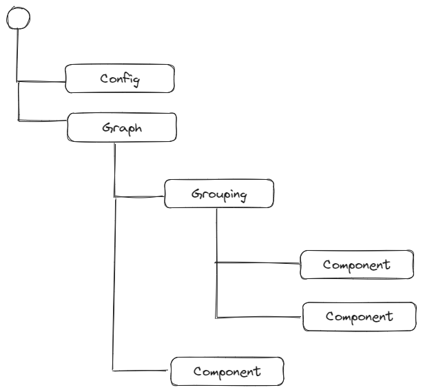
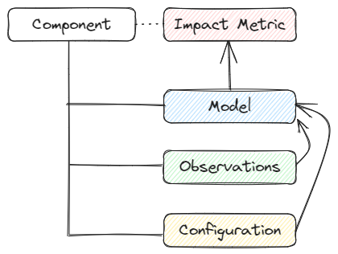

# Impact Graph

## Introduction

An Impact Graph is a manifest that defines everything you need to calculate the environmental impact of a piece of software. 

You can describe it in YAML format ([impl](Impl%20(Impact%20YAML).md)) and execute using a command line tool ([Impact](Impact.md)) using static input data ([input](input.md)). It can output a single value or a time series of outputs so you can narrow down the moments of peak environmental impacts. It can also be constructed in code using the IEF SDK for use cases where real-time streaming or monitoring of impacts is required.

It allows you to evolve, start course grained for a fast high-level impact calculation, and then add granularity (structural and temporal) over time to dig deeper and identify the areas that drive the most impacts.

It's incredibly flexible. Using plugins, you can configure it to calculate any environmental impact (carbon, water, energy) for any calculation methodology (sci, ghg, others).

The flexibility of impact graphs means they can represent a running software application, a user journey, or a campaign - it should be possible to measure anything with an impact graph. We call the thing an Impact Graph is measuring an **Impact Subject**.

It represents an Ontology of a software system—a graph of all the nested components and sub-components.

Impact Graph is the core of the Impact Engine Framework.

## Structure

See the [[Impl (Impact YAML)]] spec for the latest and complete information regarding the structure of an Impact Graph.

In summary, an Impact Graph has a root node containing configuration detailing **how** the graph is computed and a graph node containing details about all the components that make up this impact subject.

The graph's leaf nodes (**Components**) represent the components that need impacts calculated, e.g. servers, networking, and devices.

The intermediate nodes (**Groupings**) represent a grouping of leaf nodes for useful aggregation, e.g. **backend** intermediate node might contain all the leaf nodes for the backend components.

%%[[Impact Graph - Graph Summary.excalidraw|🖋 Edit in Excalidraw]], and the [[Impact Graph 2023-07-29 20.53.34.excalidraw.dark.png|dark exported image]]%%

### Component

Each component has some configuration, some inputs, and a model.
- **Configuration** describes shared information regarding this component and, most importantly, parameters required by this model.
- **inputs** are a time series of data points used as inputs to the model.
- **Model** is a plugin ([[Impact Model Plugin]]) which when given some configuration and a series of [[input]], can calculate the impact, e.g. carbon impact from an input of CPU utilization.

%%[[Impact Graph - Component.excalidraw|🖋 Edit in Excalidraw]], and the [[Impact Graph - Component.excalidraw.dark.png|dark exported image]]%%

### Computation

During graph computation, we first calculate the Component nodes to generate Impact Metrics. Then we aggregate the Impact Metrics up the tree to any Grouping nodes and, finally, a total Impact Metric for the whole graph. Every node in the graph has an impact metric; this means you can analyze a system as a who but also dig into and analyze the impacts of its components.

%%[[Impact Graph - Computation.excalidraw|🖋 Edit in Excalidraw]], and the [[Impact Graph - Computation.excalidraw.dark.png|dark exported image]]%%

A computation of an Impact Graph can create one Impact Metric. It can also be configured to return a **time series of outputs**, so you can identify the moments when impact is higher or lower. Importantly a time series is computed for every node (grouping or component) in the graph so that you can analyze the source of impact structurally and temporally.

### Pipeline

See [[Computation Pipeline]] for details regarding the phases of an Impact Graph Computation. 

In summary, there are 4 phases:
- **Calculation**: Calculating the outputs of every component leaf node.
- **Enrichment**: Enriching the outputs, e.g. calculating the carbon from energy using grid emissions data.
- **Normalization**: Bucketing the outputs into a time series of impact durations.
- **Aggregation**: Aggregating the outputs by each impact duration, up the graph, to the parent nodes and finally, the root node 

Through the above pipeline process, we can handle multiple types of calculations. To see how we can calculate an SCI score, see [[Computing SCI Scores]].

## Supporting the 4M's of Green Software

We can apply the [[4Ms]] using an Impact Graph.

- **Mapping**: Map clearly what you want to measure, the *boundary* of the subject.
- **Measure**: Decide the models you want to use to measure the subject's impact.
- **siMulate**: *Estimate* the change to the impact metric of making changes to the subject.
- **Monitor**: Measure impacts more frequently, so you tighten the feedback loop and iterate faster towards lower impacts.

Creating a graph involves **mapping** a subject you want to measure, simulate and monitor. It could be a software application, a user journey, campaign. Modeling involves adding nodes to the graph, both component and grouping nodes.

**Measuring** involves selecting and configuring the correct measurement plugins for each component in the graph and collecting inputs to pass to those plugins.

Once both steps are complete and you have a baseline, *computable*, model of your graph's impacts, you can start **simulating** the effects of making changes. You can change the model to represent a *what if* scenario (e.g. changing part of the architecture or runtime of your software), compute the new simulation graph, and see how much this affects the overall impact without making any changes to your software.

So far, graph computations are batch processes that start and end with static inputs embedded. Since the graph represents executable code that takes in some inputs to generate outputs impacts, it's possible to turn a graph calculation into a continuous process to **monitor** the impacts of your subject. Something that takes a stream of inputs in and exhausts a stream of output impacts.

### Evolution

One of the most valuable features of a graph is that it can grow and evolve; it can start small and grow in complexity over time. 

We need to add [[Granularity]] to a graph to get the most out of this process. The more granular a graph is, the more accurate the impacts will be. The more granular a graph, the more opportunities to simulate present themselves. 

Most graphs might begin life as **one** component node and **one** input. This will give you a single impact.

Once you desire to see the impacts over time, you might evolve the graph by adding multiple inputs. 

Once you want to see the impacts broken down by sub-components, you evolve the graph by adding more components.

The graph can start very simple and grow very complex, but only as complicated as you need to answer your questions and no more.

