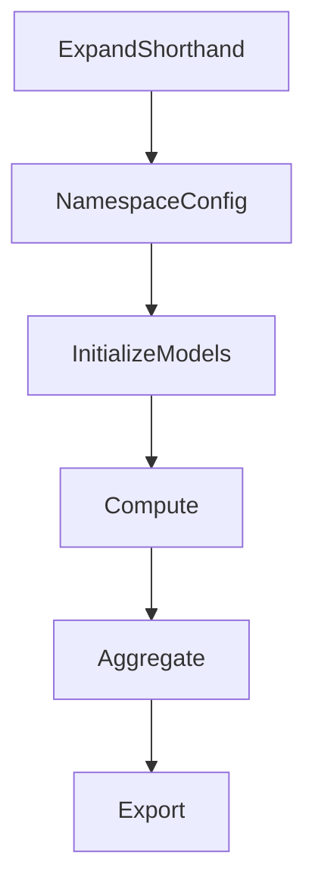

# Impact

## Introduction

Impact is a command line tool that computes [Impl (Impact YAML)](Impl%20(Impact%20YAML).md) files. 

## Quickstart

```
impact 
-impl [path to the input impl file]
-ompl [path to the output impl file]
-format [yaml|csv] (not yet implemented)
-verbose (not yet implemented)
-help  (not yet implemented)
```

- `impl`: path to an input IMPL file
- `ompl`: path to the output IMPL file where the results as saved, if none is provided it prints to stdout.
- `format`: the output file format. default to yaml but if csv is specified then it formats the outputs as a csv file for loading into another program.
- `verbose`: how much information to output about the calculation to aid investigation and debugging.
- `help`: prints out the above help file.


To use Impact, you must first configure an impl. Then, you can simply pass the path to the impl to Impact on the command line. You can also pass a path where you would like to save the output file to. For example, the following command, run from the project root, loads the `mst-eshoppen.yml` impl file from the examples directory, executes all the models defined in the impl, and saves the output to `examples/ompls/e-shoppen.yml`:

```sh
npx ts-node scripts/Impact.ts --impl ./examples/impls/msft-eshoppen.yaml --ompl ./examples/ompls/e-shoppen.yml
```


## Design Ideology

The state of an impact computation is stored in a `graph` object.

There are a series of functions defined in a [Lifecycle](#Lifecycle) section which the `graph` object as input and mutate it somehow.

At the end a processed graph is serialized back out to the end user for them to use the data.
## Lifecycle

Every `impact` execution goes through a lifecycle, a set of distinct steps which process the graph in stages.

Currenty the lifecycle is fixed but in the future this maybe be configurable via plugins.



### Expand Shorthand

- There is a short-hand way of defining an IMPL file and a long-hand way of defining it.
- The first stage of the lifecycle is to expand out the shorthand format to make the graph object easier to parse for future stages in the lifecycle of a computation.
- The first stage is to analyze the IMPL structure and if you can convert the short hand components over to the long hand form the graph object is restructured.

### Auto Children

- Some nodes for brevity leave out the `children` node if it's obvious all the other parameters of that node are `children`.
- Pseudo Code: If there is no parameter called `children`, add a parameter called `children` and add all the current params as children of that parameter.

**Shorthand Notation:**

```yaml
graph:
  grouping-node-1:
    grouping-node-2:
      component-node-1:
        pipeline: ~
        config: ~
        inputs: ~
```

**Longhand Notation:**

```yaml
graph:
  children:
    grouping-node-1:
      children:
        grouping-node-2:
          children:
            component-node-1:
              pipeline: ~
              config: ~
              inputs: ~
```

### Mirror Pipeline To Component

For simplicity we may express a common pipeline in a higher grouping node rather than express it in every component node, like so:

```yaml
graph:
  grouping-node-1:
    pipeline:
      - model-1
      - model-2
    grouping-node-2:
      component-node-1:
        pipeline: ~
        config: ~
        inputs: ~
      component-node-2:
        config: ~
        inputs: ~        
```

If a component doesn't have a pipeline defined, then copy the pipeline from the higher scope down into this component, like so:

```yaml
graph:
  grouping-node-1:
    pipeline:
      - model-1
      - model-2
    grouping-node-2:
      component-node-1:
        pipeline: ~
        config: ~
        inputs: ~
      component-node-2:
        pipeline:
          - model-1
          - model-2      
        config: ~
        inputs: ~        
```

In the above example `component-node-2` didn't have a pipeline defined so used the pipeline defined on the `grouping-node-1`.

## Namespace Config

All configuration on all levels of the graph is both merged into an input and also namespaced so that the config for different models do not conflict with each other.

Take this example:

```yaml
graph:
  config:
    model-1:
      key-1: value-1
      key-2: value-2
  children:
    grouping-node-1:
      children:
        grouping-node-2:
          config:
            model-1:
              key-2: value-2a
              key-3: value-3        
          children:
            component-node-1:
              pipeline: ~
              config: ~
              inputs: ~
```

After the above lifecycle step the graph object turns into this:

```yaml
graph:
  config:
    model-1:
      key-1: value-1
      key-2: value-2
  children:
    grouping-node-1:
      children:
        grouping-node-2:
          config:
            model-1:
              key-2: value-2a
              key-3: value-3        
          children:
            component-node-1:
              pipeline: ~
              config: ~
              inputs:
                - timestamp: xxxxx
                  key-1::model-1: value-1
                  key-2::model-1: value-2a
                  key-3::model-1: value-3
```

## Initialize Models

This step in the lifecycle loads any configured models, initializes them and makes them available from a global service.

```yaml
.
.
initialize:
  models:
    - name: <model-name>
      kind: [builtin|plugin|shell]
      path: <path-model>
      config:
	       <key>: <value>   
.
.
graph: ~
```


For every model defined in the initialize -> models configuration.

If the model is `built-in`
- import it
- create an instance of it
- call `configure` with any provided config.

If the model is a `plugin`
- dynamically load it from the path provided
- create an instance of it
- call `configure` with any provided config.

If the model is a `shell`
- create an instance of `ShellCommandImp` which allows you to interact with the shell command as if it was any other type of Imp. NOTE: This launches a sub-processes which you have to communicate with using STDIN/OUT.

Make every model available from a global `ModelService` object which returns an instance of the model for a given name.

## Compute

After all these steps in the lifecycle every component node should have all the information self-contained to compute itself.

- Loop through the nodes in the tree.
- For every component node:
  - For every model in the pipeline for the component code:
    - Pass the inputs through the model.
    - Store the results as sibling to `inputs` called `outputs` on the same component node.

> [!important] 
> Each input input is for a time and duration, and each output impact is for the same time and duration. We should link an impact to the exact input used to generate it.

Represented as [Impl (Impact YAML)](Impl%20(Impact%20YAML).md), the calculation phase would compute every component node in the tree with **inputs** like so:

```yaml
component:
  inputs: 
      - timestamp: 2023-07-06T00:00
        duration: 15 
        cpu-util: 33
      - timestamp: 2023-07-06T00:05
        duration: 5
        cpu-util: 23
      - timestamp: 2023-07-06T00:05
        duration: 5
        cpu-util: 11
```

To components with **outputs**, like so:

```yaml
component:
  outputs:
      - timestamp: 2023-07-06T00:00
        duration: 15 
        energy: 23 mWh
        cpu-util: 33
      - timestamp: 2023-07-06T15:00
        duration: 5
        cpu-util: 23
        energy: 20 mWh
      - timestamp: 2023-07-06T20:00
        duration: 5
        cpu-util: 11
        energy: 18 mWh  
  inputs: 
      - timestamp: 2023-07-06T00:00
        duration: 15 
        cpu-util: 33
      - timestamp: 2023-07-06T15:00
        duration: 5
        cpu-util: 23
      - timestamp: 2023-07-06T20:00
        duration: 5
        cpu-util: 11
```

## Aggregate (Not yet implemented)

Once all the component nodes have been computed the next step is to aggregate all the values up.

> [!important] 
> This step only makes sense if the nodes have been time synced. That is to say, every impact timestamp and duration snaps to a globally defined grid. If that's true then aggregation is a simple matter, if it's not true then aggregation might not make a lot of sense. 

## Export (TBD)

> It is curently only possible to export data as an `ompl` (output yaml). Other export options will be implemnted soon.

The final step is to export the graph into a format that has been requested by the end user.

If a file param has been provided via `-ompl` then we export as a YAML file format, for now this also means we'll be exporting the long hand notation of the IMPL files and not any shorthand. If no `-ompl` was provided then we print the results to stdout.

> [!important] 
> Exporting as a CSV file only makes sense of the nodes have been time synced. That is to say, every impact timestamp and duration snaps to a globally defined grid. If that's true then exporting as a CSV is a simple matter, if it's not true then exporting as a CSV might not make a lot of sense. 

If `-format csv` was specified then instead of outputting a YAML file we output a CSV file with each row being an impact metric for a node in the tree and each column being a specific timestamp and duration.


## Verbosity (not yet implemented)

The `-verbose` settings in impact exports a version of the graph after each step in the lifecycle process, so we can see how the lifecycle adjusts the graph and help debug any issues.

For example with the settings `-ompl path/to/my.yaml` and `-verbose` these files might be output instead.

- `my.yaml`
- `my.expand-shorthand.yaml`
- `my.normalize-config.yaml`
- `my.initialize-models.yaml`
- `my.compute.yaml`
- `my.aggregate.yaml`
- `my.export.yaml`