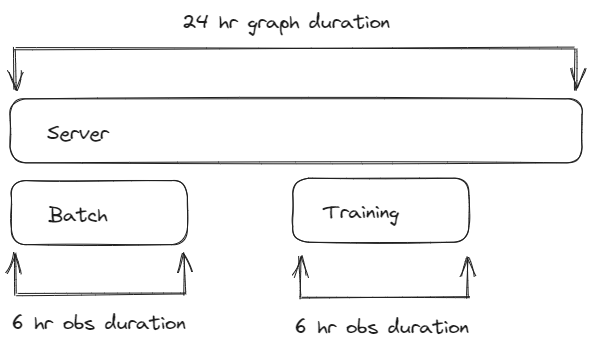
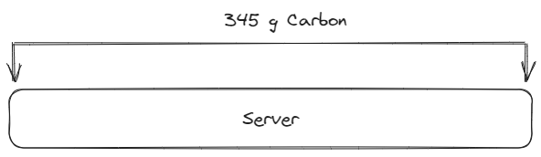
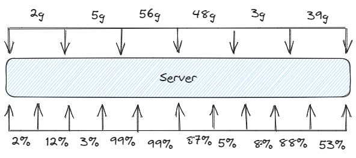

**Status**: Draft
**Author**: Asim Hussain (@jawache)
**Abstract**: A core component of impact graphing is the concept of time and specifically a duration of time. This document describes the core concept of duration as related to the calculation of an impact graph.

> [!note] Terminology
> **Graph Duration**: Total global duration for the whole Impact Graph.
> **Impact Duration**: The duration of an individual Impact Metric.
> **Observation Duration**: The duration of an individual Observation.

## Introduction

- Every [Impact Graph](design/Impact%20Graph.md) (graph) represents a **duration** of time.
- The **duration** can be explicitly defined in the graph or it can be implied by the timestamp of the first observation in any of it's components and the last timestamp (+duration of that observation).
- Duration and time is a core component of any impact measurement, every observation is for a time and duration and every output impact metric is for a time and duration. 
- The times and durations of input observations and output impact metrics do not have to match.

## Time Series

An IG can calculate one summary impact metric for the whole duration of the IG. 

Or it can compute a **time series** of output metrics for smaller buckets of time, for example when you have multiple components that scale up/down, start/stop at different times during the observation window.

If you just have one observation for one component, or one observation for multiple components that span the observation window, then generating a time series isn't so useful. It will just attribute the total impact equally across every time bucket, like so:

When it comes to outputting time series it's much more likely to surface useful information if there are multiple fine grained observations about each component in our system. For example in the image below we have one component with a time series of observations (cpu utilization)

### No Synchronization Required

From the image above you can see that the input observation time series and output impact metric time series are **not** synchronized. 

This is a very useful feature of the [Impact Graph](design/Impact%20Graph.md), you don't need to synchronize the time series of *any thing* with another thing other. Observations of components don't need to be synchronized with each other or with any output time series which you configure. There is a  phase [Impact Graph Pipeline](design/Impact%20Graph%20Pipeline.md) which handles any required synchronization. You can write plugins to customize how this synchronization occurs but by default it's weighted by time. 

This means you can provide the input observations for components with as much [Granularity](design/Granularity.md) as you can but it doesn't need to match the output time series. For some you can provide very granular data, for others you can provide less or even just one observation. Observations don't need to be synchronized with each other or anything else.

You can configure the output impact time series for every computation, and the normalization phase of computation handles everything else. You might start with one summary impact calculated for the whole window of time, then move to smaller windows of time and see if the output time series surfaces more useful information. You can play around, experiment, with the output time series as much as you want without needing to adjust any input observation time series.

