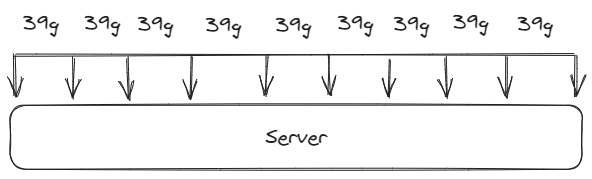
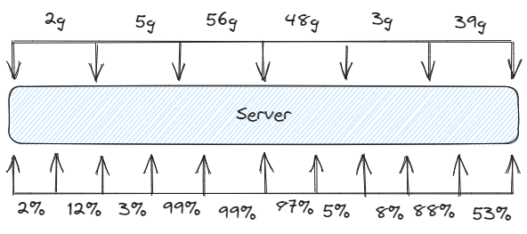

# Durations

> Terminology
> - **Graph Duration**: Total global duration for the whole Impact Graph.
> - **Impact Duration**: The duration of an individual Impact Metric.
> - **input Duration**: The duration of an individual input.

## Introduction

- Every [Impact Graph](Impact%20Graph.md) (graph) represents a **duration** of time.
- The **duration** can be explicitly defined in the graph or it can be implied by the timestamp of the first input in any of it's components and the last timestamp (+duration of that input).
- Duration and time is a core component of any impact measurement, every input is for a time and duration and every output impact metric is for a time and duration. 
- The times and durations of input inputs and output impact metrics do not have to match.

%%[🖋 Edit in Excalidraw](Durations%2024%20hr.excalidraw.md), and the [dark exported image](Durations%2024%20hr.excalidraw.dark.png)%%

## Time Series

An IG can calculate one summary impact metric for the whole duration of the IG. 

%%[🖋 Edit in Excalidraw](Durations%20-%20Single%20Impact%20-%20One%20Obs.excalidraw.md), and the [dark exported image](Durations%20-%20Bucket.excalidraw.dark.png)%%

Or it can compute a **time series** of output metrics for smaller buckets of time, for example when you have multiple components that scale up/down, start/stop at different times during the input window.

%%[🖋 Edit in Excalidraw](Durations%20-%20Bucket%20-%20Mult%20Comp%20-%20One%20Obs.excalidraw.md), and the [dark exported image](Durations%20-%20Bucket%20-%20Mult%20Comp%20-%20One%20Obs.excalidraw%201.dark.png)%%

If you just have one input for one component, or one input for multiple components that span the input window, then generating a time series isn't so useful. It will just attribute the total impact equally across every time bucket, like so:

%%[🖋 Edit in Excalidraw](Durations%20-%20Multi%20Impact%20-%20One%20Obs.excalidraw.md), and the [dark exported image](Durations%20-%20Multi%20Impact%20-%20One%20Obs.excalidraw.dark.png)%%

When it comes to outputting time series it's much more likely to surface useful information if there are multiple fine grained inputs about each component in our system. For example in the image below we have one component with a time series of inputs (cpu utilization)

%%[🖋 Edit in Excalidraw](Durations%20-%20Bucket%20-%20Mult%20Impact%20-%20Mult%20Obs.excalidraw.md), and the [dark exported image](Durations%20-%20Bucket%20-%20Mult%20Impact%20-%20Mult%20Obs.excalidraw.dark.png)%%

### No Synchronization Required

From the image above you can see that the input input time series and output impact metric time series are **not** synchronized. 

This is a very useful feature of the [Impact Graph](Impact%20Graph.md), you don't need to synchronize the time series of *any thing* with another thing other. inputs of components don't need to be synchronized with each other or with any output time series which you configure. There is a  phase [Computation Pipeline](Computation%20Pipeline.md) which handles any required synchronization. You can write plugins to customize how this synchronization occurs but by default it's weighted by time. 

This means you can provide the input inputs for components with as much [Granularity](Granularity.md) as you can but it doesn't need to match the output time series. For some you can provide very granular data, for others you can provide less or even just one input. inputs don't need to be synchronized with each other or anything else.

You can configure the output impact time series for every computation, and the normalization phase of computation handles everything else. You might start with one summary impact calculated for the whole window of time, then move to smaller windows of time and see if the output time series surfaces more useful information. You can play around, experiment, with the output time series as much as you want without needing to adjust any input input time series.

